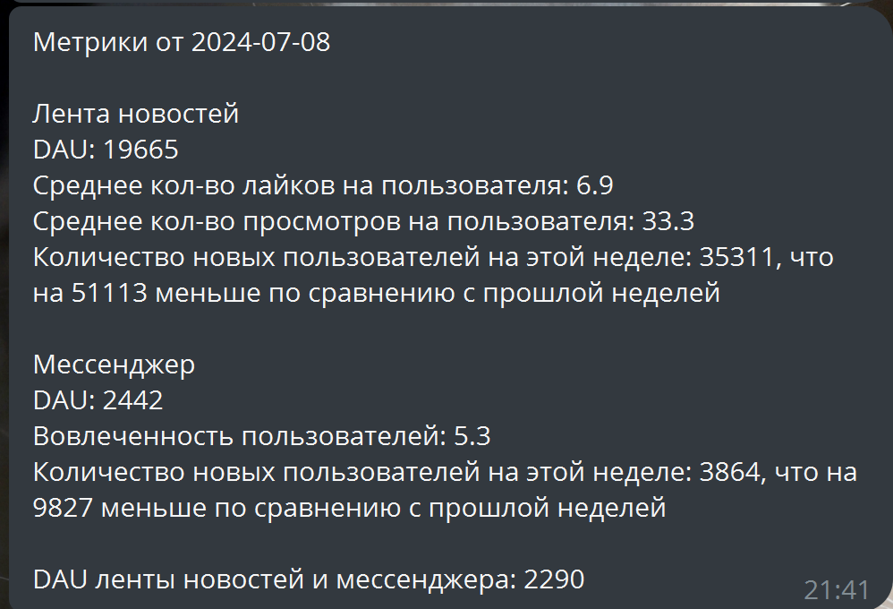
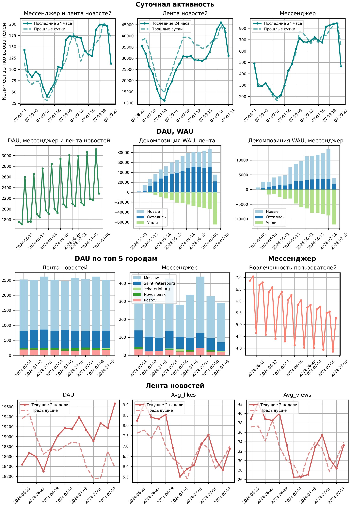

# Chatbot-for-sending-reports

### Описание
Необходимо автоматизировать процесс сбора основных метрик за предыдущий день и отправку отчета в чат.

##### Исходные данные
Две таблицы со следующими полями
feed_actions (лента новостей):
* user_id - id пользователя
* post_id - id поста
* action - действие пользователя
* time - время совершения действия
* city - город

message_actions (мессенджер):
* user_id - id отправителя сообщения
* receiver_id - id получателя сообщения
* time - время отправления сообщения
* city - город, откуда отправили сообщение

##### Ход работы
* Создан чат-бот, который отправляет отчеты.
* Собраны метрики и построен дашборд для ежедневной отчетности по системе. Рассматриваются следующие показатели:
  * Суточная активность пользователей ленты новостей, мессенджера и системы в целом
  * DAU системы в целом
  * Декомпозиция WAU (количество новых пользователей, ушедших и вернувшихся) по ленте новостей и по мессенджеру
  * DAU по топ 5 городам по количеству пользователей для ленты новостей и мессенджера
  * Вовлеченность пользователей мессенджера (количество отправленных сообщений/количество уникальных пользователей)
  * Метрики ленты новостей: DAU, среднее количество лайков, просмотров постов.
* С помощью Airflow автоматизирован ежедневный сбор отчета и его отправка.

В результате в чат каждый день в 11 часов приходит отчет следующего вида:

  

  

